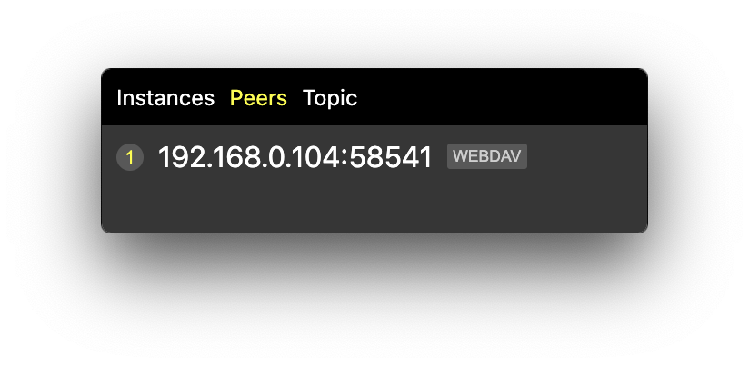

  <h1>@humusties/parasite</h1>

  

  HTTP Web Hosting from Home
 Distributed signaling with Local Hosting
 Built upon Hyperswarm and Kadmelia DHT

  

  Share your directories over HTTP and Webdav to peers of a topic

  

  Explore their directories using your favourite Browser.
    Webdav support let you mount them inside your Filesystem !
    Once you quit, your local server is closed and no one can access your data anymore, **ever**.
    It's supposed to help you be in total control of your data.

